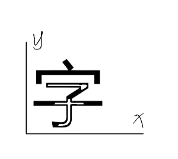

This doc is for coordinates system refer to this project

# Original coor in TTF


## after uni2pnts
```math
\begin{cases}
x = x' + \delta x \\
y = y' + \delta y 
\end{cases}
```



## after pnt2skeleton

coor sys keep the same


## stroke analysis

green line meanning 
```math
    y = x + m \\
    \rightarrow m = y-x
```

in Chinese word, the stroke always begin at

```math
    argmax(m), y \in Y, x \in X.
```


## after get_max_continue

coor sys keep the same


